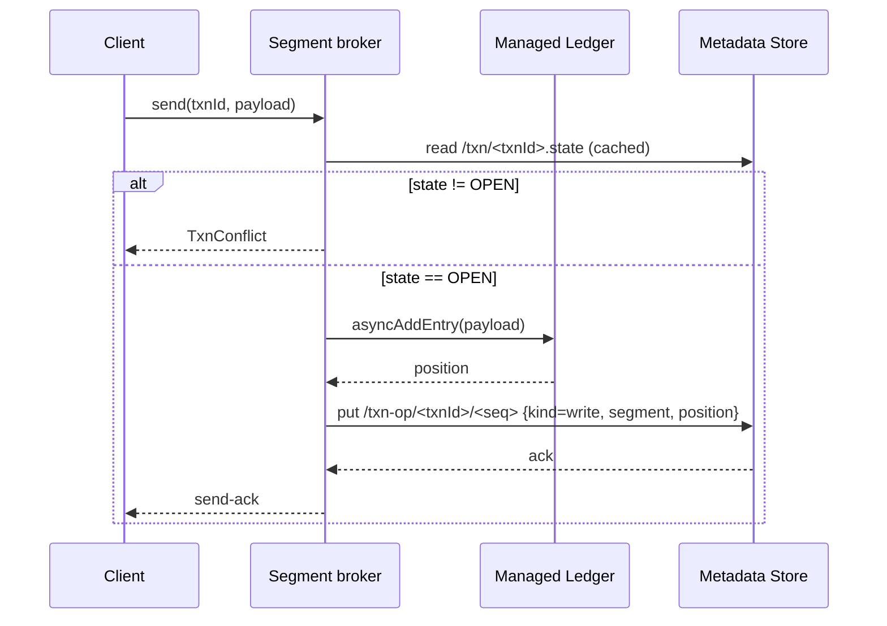
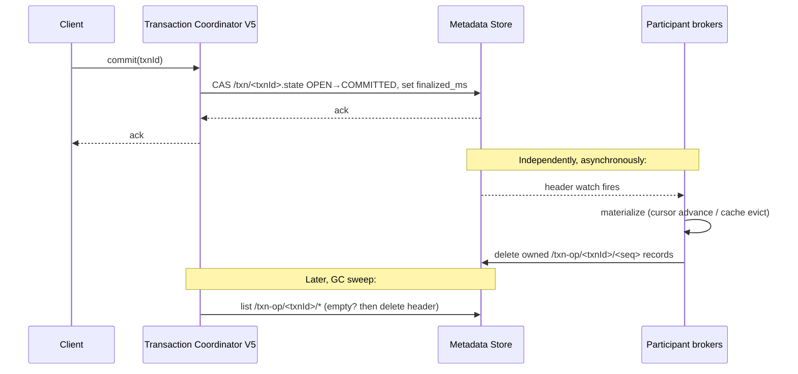

# PIP-473: Metadata-Driven Transactions for Scalable Topics

*Sub-PIP of [PIP-460: Scalable Topics](pip-460.md)*

## Background

### Pulsar's existing transaction model

Pulsar transactions today are realized through three components:

- **Transaction Coordinator (TC)** — a per-broker service backed by a system topic (`__transaction_log_*` in `pulsar/system`) that tracks the lifecycle of every transaction (`OPEN`, `COMMITTING`, `COMMITTED`, `ABORTING`, `ABORTED`, `TIME_OUT`) and orchestrates two-phase commit across the topics that participate in each transaction.
- **TransactionBuffer (TB)** — a per-`PersistentTopic` component that buffers transactional writes in the topic's data stream, tracks aborted transaction IDs, and gates the dispatcher's read horizon (`maxReadPosition`) so that uncommitted entries are not delivered. The TB persists its state in a per-namespace system topic (`__transaction_buffer_snapshot`).
- **PendingAckStore** — a per-(topic, subscription) component that records transactional acknowledgments in a sibling persistent topic (`<topic>-<sub>__transaction_pending_ack`), applying them to the cursor only when the transaction commits.

When a transaction ends, the TC sends `END_TXN_ON_PARTITION` (and `END_TXN_ON_SUBSCRIPTION` for acks) to every participant. The TB then writes a **commit or abort marker** as a regular entry in the topic's managed ledger. The dispatcher discovers committed/aborted state by replaying these markers and consulting the in-memory aborted-txn set.

### Scalable topics

[PIP-460](pip-460.md) introduces scalable topics: a logical topic backed by a DAG of range segments (`segment://...`) that can be split or merged at runtime. Each segment is a regular `PersistentTopic` from the broker's perspective, but the segment's lifetime is controlled by the [scalable topic controller](pip-468.md) — segments get **sealed** when split or merged, after which the segment's managed ledger no longer accepts writes.

### How the two interact

The current transaction implementation composes per-`PersistentTopic`. With scalable topics, every segment carries its own TB. This composition fails in two ways:

1. **End-of-transaction stalls on sealed segments.** The TC sends `END_TXN_ON_PARTITION` to each segment that received writes. The segment's TB tries to append a commit/abort marker — which is a write — and the now-sealed segment rejects it. The end-txn RPC times out (~30s).
2. **Pending-ack topic naming collides with the segment-domain parser.** The convention `<topic>-<sub>__transaction_pending_ack` is unparseable when `<topic>` is a `segment://...` URI. (Worked around in #25631 with a flat persistent name; see "Out of Scope" below.)

The first issue is structural, not just a routing bug. As long as commit/abort decisions need to be persisted **inside the topic's data stream**, sealing the topic terminates any in-flight transaction.

---

## Motivation

We need transactions that:

1. Provide atomicity across multiple writes and acknowledgments, possibly spanning multiple topics across multiple namespaces.
2. Compose correctly with the scalable-topic lifecycle — including splits, merges, and segments sealed mid-transaction.
3. Do not require duplicating data (each `producer.send` produces a single managed-ledger append).
4. Reuse as much of the existing transaction surface as possible — interfaces, dispatcher integration, client API — so that we are not re-litigating well-understood concerns.
5. Coexist with v4 transactions on `persistent://` topics with no behavior change for those topics.

The structural mismatch between in-stream markers and a mutable segment DAG cannot be papered over at the routing or the topic-naming layer. It needs a transaction representation that does not put the decision record inside the data stream.

---

## Goals

### In Scope

- Atomic transactions over `segment://` topics (writes and acks), including transactions whose lifetime spans split/merge.
- Multi-topic, multi-namespace, multi-segment transactions with the same atomicity guarantees as today.
- Reuse of the existing `Transaction`, `TransactionCoordinator`, `TransactionBuffer`, `PendingAckStore`, dispatcher, and client APIs. New behavior arrives as alternative implementations behind the existing interfaces.
- Coexistence with the legacy in-stream-marker implementation for `persistent://` topics.

### Out of Scope

- Replacing the legacy implementation for non-scalable topics. The new implementation is opt-in per topic; `persistent://` topics keep their current behavior, including the existing TC.
- Replacing the segment-aware pending-ack topic name introduced in #25631 — that workaround becomes unnecessary as a side effect of this PIP and is removed in the same change.
- Cross-cluster (geo-replicated) transactional semantics.

---

## High Level Design

The proposal is one sentence:

> **Move transactional state out of the data stream and into the metadata store.**

Concretely: keep all existing components and interfaces, and add a parallel implementation of `TransactionBuffer`, `PendingAckStore`, **and Transaction Coordinator** that writes nothing to any data stream. Their state lives entirely in the metadata store. The legacy in-stream-marker components remain, unchanged, for `persistent://` topics; the new metadata-driven components handle `segment://` topics. The dispatcher's contract is unchanged.

Why introduce a v5 TC rather than reuse the legacy one: the legacy TC stores its log in a system topic (`__transaction_log_*`), which carries the operational concerns of any system topic — compaction can lead to long recovery times, leadership has to be maintained, and recovery is on the data path. With the metadata store available we can have a TC whose state is just a few key-value records, no log, no system topic, no per-broker in-memory replay. Running both TC implementations in parallel keeps v4 transactions byte-for-byte unchanged while the v5 path uses the simpler design.

### Why this works for scalable topics

- **Sealing a segment is irrelevant.** Commit/abort no longer require any append to the segment. End-txn becomes a metadata-store CAS on a single record. Sealed segments materialize the decision (advance cursors, evict cache entries) without writing anything.
- **The dispatcher does not change.** It already asks the topic's TB for `maxReadPosition` and `isTxnAborted`. We swap the source.
- **Splits/merges do not strand transactions.** Sealed parents and live children both consult the same metadata; the decision lives above the segments.
- **No data is duplicated.** Each transactional `send` produces exactly one managed-ledger append, same as today.

### Architecture Overview

```
┌──────────────────────────────────────────────────────────────────┐
│   Client (V5)  -- producer.send(txn,...)                          │
│                -- consumer.acknowledge(id, txn)                   │
└─────────────────────────────────┬─────────────────────────────────┘
                                  │
            ┌─────────────────────┴─────────────────────┐
            │                                            │
┌───────────▼────────────────┐         ┌────────────────▼──────────────┐
│   Transaction Coordinator   │         │   Transaction Coordinator V5   │
│   (legacy, BK-backed log)   │         │   (metadata-store records)     │
│   → v4 / persistent:// txns │         │   → v5 / segment:// txns       │
└───────────┬────────────────┘         └────────────────┬──────────────┘
            │                                            │
            │ END_TXN_ON_PARTITION / SUBSCRIPTION        │
            ▼                                            ▼
┌─────────────────────────────────────────────────────────────────────┐
│   Per-topic broker components                                        │
│                                                                      │
│   ┌──────────────────────────┐  ┌────────────────────────┐          │
│   │ TopicTransactionBuffer    │  │ MLPendingAckStore      │          │
│   │ (in-stream markers)       │  │ (sibling topic)        │          │
│   │  → persistent:// topics   │  │  → persistent:// topics│          │
│   └──────────────────────────┘  └────────────────────────┘          │
│                                                                      │
│   ┌──────────────────────────┐  ┌────────────────────────┐          │
│   │ MetadataTransactionBuffer │  │ MetadataPendingAckStore│          │
│   │ (metadata-store records)  │  │ (metadata-store records)          │
│   │  → segment:// topics      │  │  → segment:// topics   │          │
│   └────────┬─────────────────┘  └─────────┬──────────────┘          │
└────────────┼──────────────────────────────┼─────────────────────────┘
             │                              │
             ▼                              ▼
           Metadata Store — txn coordinator state + txn-op records + secondary indexes
```

The `TransactionBufferProvider` and `TransactionPendingAckStoreProvider` SPIs already exist. The new TB / PendingAckStore implementations slot in behind them. The v5 TC is a parallel coordinator selected by the client when it is configured for the new path. Selection on the participant side is per-topic, based on the topic's domain.

---

## Detailed Design

### Data Model

The metadata store holds two classes of records and four secondary indexes. All records for a given transaction share the same **partition key** (`txnId`) so they are co-located — this makes per-txn scans (e.g. listing all ops to apply at end-txn time) a single-partition operation rather than a fan-out.

> **A note on metadata-store backends.** The design is `MetadataStore`-agnostic. It depends on three capabilities — partition-key co-location, sequential keys, and secondary indexes with range queries and range-watch — that the `MetadataStore` interface does not expose today. We extend the interface to surface them; backends that natively support these (notably Oxia, the intended default) implement them directly, while backends that don't (e.g. ZooKeeper) can implement them in a less efficient way (client-side counters for sequential IDs; client-maintained index records; periodic re-list in lieu of range-watch). Correctness does not depend on backend choice; throughput and recovery latency may.

#### Header — one per transaction. Linearization point.

```
/txn/<txnId>                        partitionKey = txnId
  =  {
       state:       OPEN | COMMITTED | ABORTED,
       timeout_ms:  <abs epoch ms>,
       created_ms:  <abs epoch ms>
     }
```

State transitions are conditional puts (CAS on version) issued by the v5 TC. `OPEN → COMMITTED` and `OPEN → ABORTED` are the only allowed transitions; `COMMITTED` and `ABORTED` are terminal.

#### Operation records — one per transactional write or ack. Unbounded.

```
/txn-op/<txnId>/<seq>               partitionKey = txnId,
                                    sequential   = true     # server-assigned <seq>
  =  {
       kind:         "write" | "ack",
       segment:      "segment://t/n/x/<descriptor>",  # always present
       subscription: "<sub-fqn>",                     # ack only
       position:     <ledgerId>:<entryId>
     }
```

Each operation is its own record, so a transaction has no size limit and concurrent participants do not contend on a single record. With **sequential keys** the server (or, on backends that lack them, a `MetadataStore`-side counter) assigns `<seq>`, eliminating client-side collisions.

#### Secondary indexes (auto-maintained by the metadata store)

```
idx:writes-by-segment              on /txn-op/* where kind=write
                                   key = segment
                                   →  range query "writes touching segment S"

idx:acks-by-segment-subscription   on /txn-op/* where kind=ack
                                   key = (segment, subscription)
                                   →  range query "acks on (segment S, subscription SU)"

idx:txn-by-deadline                on /txn/* where state=OPEN
                                   key = timeout_ms
                                   →  range query "open txns past deadline"
                                   →  used by TC for timeout-driven abort

idx:txn-by-final-state             on /txn/* where state ∈ {COMMITTED, ABORTED}
                                   key = (state, finalized_ms)
                                   →  range query "finalized txns ready for GC"
                                   →  used by GC sweep to find finalized txns whose op records can be deleted
```

#### Garbage collection

A finalized transaction (`COMMITTED` or `ABORTED`) is removed in two phases:

1. **Per-participant materialization.** When the TC fans out end-txn, each participant broker materializes the decision (commit: advance subscription cursors for acks, evict header cache; abort: drop ops). Once a participant has finished its materialization for `<txnId>`, it deletes its op records (`/txn-op/<txnId>/<seq>` for ops it owns).
2. **Header GC sweep.** A periodic sweep scans `idx:txn-by-final-state` for entries past a configurable retention window (e.g. 60 s after `finalized_ms`). For each, it verifies no `/txn-op/<txnId>/*` records remain (orphan check from a participant crash), forces deletion of any leftovers, and finally deletes the header `/txn/<txnId>`.

Because all of a txn's records share the same partition (`partitionKey = txnId`), the GC sweep's per-txn cleanup stays in one partition: list `/txn-op/<txnId>/`, delete, then delete the header.

Indexes update transactionally with the underlying records, so they self-clean.

### Components

#### `MetadataTransactionBuffer` (new)

Implements the existing `TransactionBuffer` interface. Used for `segment://` topics.

| Method | Behavior |
|---|---|
| `appendBufferToTxn(txnId, buf)` | `ML.asyncAddEntry(buf)`; on success, append a sequential `/txn-op/<txnId>/<seq>` (`partitionKey=txnId`) with `kind="write", segment, position`. The publish ack waits for both. |
| `commit(txnId, position)` / `abort(...)` | Not invoked by the v5 TC (which does not RPC participants). The TB's header watch fires when `/txn/<txnId>.state` changes; the TB then materializes locally (evict / mark-aborted) and deletes its owned op records. |
| `getMaxReadPosition()` | Read from in-memory cache. Cache is populated by a watch on `idx:writes-by-segment == <my-segment>` joined against the header cache. Result: `min(position over OPEN txns) - 1`, capped at LAC. |
| `isTxnAborted(msg)` | Look up `/txn/<txnId>.state` from header cache. |
| `recover()` | Open the index watch and the header cache; populate from the current snapshot. No log replay, no snapshot topic. |

#### `MetadataPendingAckStore` (new)

Implements the existing `PendingAckStore` interface. Used for `segment://` topic subscriptions.

| Method | Behavior |
|---|---|
| `appendIndividualAck(txnId, positions)` | Append sequential `/txn-op/<txnId>/<seq>` records with `kind="ack", segment, subscription, position`. |
| `appendCumulativeAck(...)` | Same shape, single op record carrying the cumulative position. |
| `commit(txnId)` / `abort(txnId)` | Not invoked by the v5 TC. Triggered locally when the header watch on `/txn/<txnId>.state` fires. Commit: range-query `idx:acks-by-segment-subscription == (<my-segment>, <my-subscription>)` filtered to `<txnId>`; apply to cursor (`markDelete` or `individualAck`); range-delete the op records. Abort: range-delete the op records, no cursor work. |
| `replayAsync()` (recovery) | Range-query `idx:acks-by-segment-subscription == (<my-segment>, <my-subscription>)`, group by `txnId`, hydrate in-memory state. |

#### Transaction Coordinator V5 (new)

A parallel coordinator selected by the v5 client. Same client-facing wire commands (`NEW_TXN`, `ADD_PARTITION_TO_TXN`, `ADD_SUBSCRIPTION_TO_TXN`, `END_TXN`), but no system-topic log: every operation reads or CAS's a metadata-store record. **The TC does not RPC participants** — see "Notification mechanism" below.

| Operation | Behavior |
|---|---|
| `newTxn(timeoutMs)` | Create `/txn/<txnId>` with `state=OPEN`, `timeout_ms=now+timeoutMs`. |
| `addPartitionToTxn` / `addSubscriptionToTxn` | No-op at the coordinator. The participant broker writes its own op records when the actual write/ack arrives; the TC never needs to enumerate participants. |
| `endTxn(COMMIT\|ABORT)` | A single CAS on `/txn/<txnId>.state`. After it returns, the TC sets `finalized_ms` on the header and acks the client. No fan-out, no waiting on participants. |
| Timeout sweep | Range-query `idx:txn-by-deadline` for entries with `timeout_ms ≤ now`, abort each (same single-CAS flow). |
| GC sweep | Range-query `idx:txn-by-final-state` for entries past retention; for each, verify `/txn-op/<txnId>/*` is empty (force-delete leftovers); delete header. |

Why parallel rather than reusing the legacy TC: the legacy TC's per-shard system topic (`__transaction_log_*`) requires leadership election, runs compaction over its own log, and pays a recovery cost on every broker restart proportional to the live transaction set. The v5 TC's state is just per-txn KV records — there is no log to compact and no cold-start replay. Running both in parallel keeps v4 transactions byte-for-byte unchanged while the v5 path uses the simpler design. A v5 client routes its `NEW_TXN` to the v5 TC; v4 clients route to the legacy TC. A single transaction does not span the two.

#### Notification mechanism (TC → participants)

The legacy TC needs to RPC each participant (`END_TXN_ON_PARTITION`, `END_TXN_ON_SUBSCRIPTION`) because the participants have no other way to learn the decision — the TC's log is the only source of truth, and only the TC reads it.

In the v5 design **the metadata store is the source of truth**, and every participant already reads from it. Participants therefore learn about state transitions directly from the store, without any TC-to-broker RPC:

- A `MetadataTransactionBuffer` keeps an in-memory header cache for txns it has writes from. The cache entries are populated when a write op record is appended (the broker reads the header to authorize the write) and **kept up to date by point-watches on the headers it has cached**.
- A `MetadataPendingAckStore` maintains the same pattern for txns it has acks from.
- When the TC CAS's `/txn/<txnId>.state` from OPEN → COMMITTED/ABORTED, every cached watcher fires. Each participant materializes locally:
  - **Commit** — TB evicts its cache entry (the txn no longer pins `maxReadPosition` back); PendingAckStore applies the buffered acks to the cursor.
  - **Abort** — TB marks the txn aborted in its cache (the dispatcher's `isTxnAborted` will skip those entries); PendingAckStore drops the buffered acks.
- After materialization, the participant deletes the op records it owns (`/txn-op/<txnId>/<seq>` for ops on its segment / subscription).
- The TC's GC sweep (above) detects when all participants have done their cleanup — the prefix `/txn-op/<txnId>/*` is empty — and deletes the header.

Consequences:

- **End-txn latency.** From the client's perspective, `commit` returns as soon as the header CAS lands. From a consumer's perspective, freshly-committed entries become visible after the participant's header watch fires + materialization runs. That's typically tens of milliseconds; bounded by metadata-store watch propagation. (If we ever care about a tighter bound — e.g. for a given workload — the TC can issue an optional `nudge` RPC to participants in parallel with the CAS. Not needed for correctness; not in this PIP.)
- **No RPC fan-out from TC.** End-txn is `O(1)` work at the TC: one CAS. The cost of fan-out is paid by the metadata store's watch-delivery infrastructure, which already exists for other Pulsar uses.
- **Crash idempotence.** A participant that crashes during materialization restarts, observes the (already-final) header state via its watch, and finishes materialization. The TC need not retry anything.

#### Dispatcher

Unchanged. It already asks `topic.getTransactionBuffer().getMaxReadPosition()` and `topic.getTransactionBuffer().isTxnAborted(...)`. The new TB implements both.

### Flows

#### Publish (transactional)



The header read is cache-first; the cache is invalidated by the same watch the TB already maintains on the header. The op-record put is the only synchronous metadata-store write on the publish path.

#### End-txn (commit or abort)



The CAS on the header is the linearization point — that is when the transaction's outcome is decided. Notification of participants is not part of the linearization; it propagates via the watches every participant already maintains on the headers it has cached. Sealed segments are fine — materialization is metadata + cursor work, no managed-ledger writes.

#### Subscribe / dispatch

Unchanged. The dispatcher polls `tb.getMaxReadPosition()` and filters by `tb.isTxnAborted(msg)`. The `MetadataTransactionBuffer` answers both from its in-memory caches, fed by metadata-store watches.

#### Late-write race

The TC is mid-end-txn when the client publishes once more inside the same transaction. The header CAS may have already flipped to `COMMITTED`/`ABORTED`. The publish-path header check on the participant broker rejects with `TxnConflict`. This mirrors today's TC behavior (the TC marks transactions as ENDING and brokers reject new writes); the only difference is that the rejection criterion is now read from the metadata store rather than from a TC RPC.

### Recovery

- **Broker startup.** Each `MetadataTransactionBuffer` opens its index watch and header cache. The first watch event delivers the snapshot; the TB is ready as soon as the snapshot has been applied. No log replay, no system-topic reader, no snapshot topic.
- **Broker crash mid-publish.** If the broker appended the entry but crashed before writing the op record, the entry exists in the segment but no metadata claims it. On txn timeout the TC aborts the txn; the dispatcher's `isTxnAborted` check (which falls back to "abort" for unknown txnIds at retention horizon) discards the entry.
- **Broker crash mid-end-txn.** If the header CAS landed but materialization on a participant did not complete, the participant re-derives state from the header on restart and finishes materialization. End-txn is idempotent.
- **TC failover.** The v5 TC has no in-memory log to replay — its state lives in the metadata store. Whichever broker takes over coordinator duty for a TC partition resumes operations directly from the metadata-store records. Cold-start cost is bounded by `idx:txn-by-deadline` and `idx:txn-by-final-state` scans, not by replay of an entire transaction log.

### Concurrency and contention

- Each transactional publish writes a unique `/txn-op/<txnId>/<seq>` record (server-assigned sequential key). There is no contention between concurrent participants of the same transaction.
- The header is CAS'd at most twice per transaction lifetime (open + finalize), so contention there is bounded.
- All records for a given txn share `partitionKey=txnId`, so per-txn operations (list, range-delete) stay on a single partition.
- Index updates are managed by the metadata store; their scaling is the store's concern.

---

## Public-facing Changes

### Public API

No changes. The client-facing `Transaction` API is unchanged.

### Binary protocol

No changes to client-facing wire commands (`NEW_TXN`, `ADD_PARTITION_TO_TXN`, `ADD_SUBSCRIPTION_TO_TXN`, `END_TXN`) — the v5 TC accepts them with the same semantics as the legacy TC.

The broker-to-broker commands `END_TXN_ON_PARTITION` and `END_TXN_ON_SUBSCRIPTION` are **not used** by the v5 path: participant brokers learn about the decision by watching the metadata-store header rather than by receiving an RPC from the TC. The legacy TC still uses these commands for v4 transactions; they remain in the protocol unchanged.

### Configuration

A per-namespace or per-broker setting selects the TB implementation. Default for `segment://` topics: metadata-driven. Default for `persistent://` topics: in-stream markers (unchanged). Override is possible per-namespace for debugging / migration.

### Metrics

Existing transaction metrics remain. The metadata-driven implementation adds:

- `pulsar_txn_metadata_store_op_writes_total` (counter) — op records written.
- `pulsar_txn_metadata_store_header_cas_total{result="ok|conflict|reject"}` (counter) — header CAS attempts and outcomes.
- `pulsar_txn_metadata_store_index_query_seconds` (histogram) — latency of the index range queries on `idx:writes-by-segment` / `idx:acks-by-segment-subscription`.
- `pulsar_txn_metadata_store_outstanding_op_records` (gauge) — uncollected op records (a proxy for txn GC backlog).

Existing `pulsar_txn_tb_*` snapshot/replay metrics are not emitted by the new implementation (no snapshots, no replay).

---

## Backward & Forward Compatibility

### Upgrade

- Existing `persistent://` topic behavior is unchanged. v4 clients see no difference.
- Brokers running this PIP can interoperate with brokers that do not, as long as a given **topic** is consistently served by brokers of one kind. Since topic ownership is bundle-based and migration via load-balancer transfers TB state across, this is satisfied automatically.
- Per-segment pending-ack topics created by the workaround in #25631 (`persistent://t/n/<localName>-<descriptor>-<sub>__transaction_pending_ack`) are no longer used. They are deleted as part of upgrade. Since the workaround was only ever exercised by V5 transactional consumer flows, the upgrade path is safe.

### Downgrade / Rollback

Not applicable. Scalable topics are introduced as a new feature in Pulsar 5.0 ([PIP-460](pip-460.md)); this PIP defines transactional support for that feature from the start. There is no prior version to roll back to.

### Pulsar Geo-Replication

Out of scope. Transactional geo-replication is not supported in either model.

---

## Alternatives Considered

### A. Move TB to the scalable-topic level (one TB per logical topic)

Earlier draft of this design. Architecturally clean — decisions live above segments — but introduces a new broker-side singleton per scalable topic, adds new failover semantics, and complicates the TC's wire protocol (end-txn would need redirection from segment to scalable-topic owner). Replacing the per-topic TB **implementation** with a metadata-driven one achieves the same correctness without any of that surface area.

### B. Per-segment TB but using an off-segment marker stream

Keep the per-segment TB; have it write commit/abort markers to a **separate** managed ledger (e.g. a shadow topic) rather than into the segment's own data. Sealed segments would no longer block end-txn. Rejected because: (1) it doubles the data path (every txn needs a write to the segment **and** to the shadow topic), (2) it requires a new system-topic-per-segment, and (3) it does not eliminate the snapshot/replay machinery that the metadata-driven approach removes outright.

### C. Skip transactional support on scalable topics

Document scalable topics as non-transactional. Rejected: the transactional consume-and-produce pattern is a primary use case for scalable streaming workloads (Kafka Streams analogue), and PIP-460's roadmap explicitly calls out transactions across range segments as a Phase 4 deliverable.

---

## General Notes

The shape of the change is *one new `TransactionBuffer` implementation, one new `PendingAckStore` implementation, one new `TransactionCoordinator` implementation, and the `MetadataStore` extensions to support partition-key co-location, sequential keys, and secondary indexes with range-watch*. The complexity is in the interaction of the metadata schema with the dispatcher's existing assumptions, not in any new system component on the broker.

## Links

- [PIP-460: Scalable Topics](pip-460.md)
- [PIP-468: Scalable Topic Controller](pip-468.md)
- Mailing List discussion thread: TBD
- Mailing List voting thread: TBD
