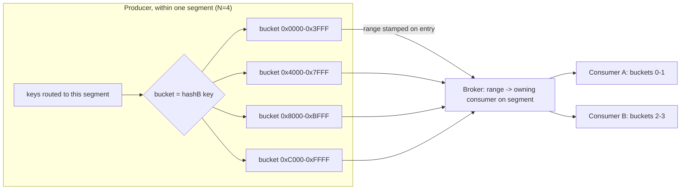

# PIP-486: Scalable Topic Key-Shared Consumption

*Sub-PIP of [PIP-460: Scalable Topics](pip-460.md)*

> **Draft.** The design is settled: a configurable per-topic entry-bucket budget, an explicit 16-bit
> `hashB` range on the wire, an immutable per-segment bucket count, and controller-driven assignment.
> Remaining specifics — the policy threshold values, and the durable per-bucket checkpoint representation
> — are tuning defaults and checkpoint-consumer-spec detail rather than open design choices.

## Motivation

[PIP-468](pip-468.md) and [PIP-483](pip-483.md) give scalable topics a DAG of range segments that split
and merge automatically. The steady-state model for **ordered** consumption (stream / checkpoint
consumers) is **one consumer per active segment**: each segment is an independent ordered substream, and
parallelism comes from having more segments. This is the most efficient mode — a segment's entries are
dispatched whole to a single consumer, with no per-message routing cost.

> **Scope:** this PIP concerns **ordered consumption** only. Queue (`Shared`) consumers are already
> parallelized by round-robin delivery at the batch level and are **unaffected** — they need no
> bucketing. Everything below applies to stream and checkpoint consumers.

There are several situations where one-consumer-per-segment is *not* the right mode:

1. **Draining a sealed-segment backlog after a scale-up.** Start with 1 segment and 1 consumer. The
   consumer falls behind, the application scales to 10 consumers, and auto-split ([PIP-483](pip-483.md))
   immediately grows the topic to 10 segments — good for *new* traffic. But the pre-split backlog is
   stuck in the old, now-sealed segment, and per-key ordering requires that sealed segment to be fully
   drained before its successors are consumed for the same key range. A single consumer draining one
   sealed segment is exactly the bottleneck the scale-up was meant to remove. We want to *temporarily*
   fan that sealed segment's backlog across several consumers, then revert.

2. **Many low-throughput topics.** When there are many topics each with low throughput and several
   consumers, materializing many physical segments per topic is wasteful. Key-shared over a small number
   of segments gives consumer parallelism without paying for segment fan-out we do not need.

3. **More consumers than the max-segments ceiling.** A topic caps segments (say `max-segments = 64`) to
   bound metadata and resource overhead. With 200 consumers, 64 segments cannot give every consumer its
   own substream. Raising the per-segment bucket count — e.g. 4 buckets on each of 64 segments → 256
   independently-routable substreams — activates all 200 consumers without an excessive segment count.
   Buckets are the parallelism multiplier *beyond* the segment cap.

The blocker for all of these is that **Pulsar's key-shared dispatch couples the producer's batching mode
to the consumer's subscription mode.** Today the broker routes by a single key per *entry*, so correct
key-shared delivery requires the producer to disable batching or use the key-based batcher (one batch
per key). That is an unacceptable coupling for scalable topics, where the consumption mode is a dynamic,
consumer-side decision the producer should neither know about nor be constrained by.

This PIP removes that coupling.

## Background knowledge

**Key-shared dispatch today.** For a `Key_Shared` subscription the broker computes one sticky-key hash
per entry and maps it to a consumer **at dispatch time** via a consistent-hash ring
(`ConsistentHashingStickyKeyConsumerSelector`). The key is read from the *outer, uncompressed*
`MessageMetadata` only (`Commands.resolveStickyKey`); the broker **never decompresses the batch
payload**, so per-message keys inside `SingleMessageMetadata` are not consulted. A batched entry is
dispatched *whole* to a *single* consumer.

**Why `KeyBasedBatcher` is required today.** Because routing is "one key per entry," a default-batched
entry that mixes keys routes entirely to whichever consumer owns the entry's outer key, violating
affinity for the other keys. `BatchMessageKeyBasedContainer` works around this by putting one key per
batch — collapsing to *no batching* at high key cardinality.

**Per-bucket pending tracking is simpler than today's key tracking.** The current Key_Shared dispatcher
tracks pending/replay state per *key* (a large, dynamic set). Routing by a fixed, small set of buckets
lets the dispatcher track pending messages **per bucket** instead — fewer, stable units.

**Scalable-topic hash ring.** A scalable topic's keyspace is the 16-bit segment-routing ring
(`HashRange`, `0x0000–0xFFFF`). Each segment owns a contiguous sub-range; splits/merges adjust range
ownership without rewriting committed data.

## Goals

### In Scope

- Per-message-key (key-shared) **ordered** consumption on a scalable-topic segment **without**
  constraining the producer's batching mode; producer batching and consumer mode independently chosen.
- The three use cases above: temporary sealed-segment drain, low-throughput consolidation, and
  parallelism beyond the max-segments ceiling.
- Preserve per-key ordering across all transitions.

### Out of Scope

- **Queue (`Shared`) consumers** — already round-robin at the batch level; unaffected.
- Changing the one-consumer-per-segment model for high-throughput ordered consumption.
- Key-shared semantics for classic (non-scalable) topics.

## High Level Design

Routing is **two independent levels**, and the new primitive is the **entry bucket** — a contiguous
sub-range of a second, independent hash ring — together with a configurable **per-topic entry-bucket
budget**.

### Entry buckets

1. **Segment routing (existing, PIP-468).** A key's segment is chosen by the segment-routing hash over
   the 16-bit ring; the key lands in whichever segment owns that sub-range. Happens first — the producer
   is already writing to a specific segment.
2. **Intra-segment bucketing (this PIP).** A **separate, independent** hash `hashB(key)` maps keys onto
   a second ring, and each segment divides *that* ring into `N` equal **buckets** — a bucket is a
   contiguous `hashB` sub-range `[start, end)`. `hashB` must be independent of the segment-routing hash
   (see [the bucket hash](#the-bucket-hash)), so the keys a segment actually receives spread evenly
   across its buckets — with `N = 2`, each bucket gets ≈ half the segment's traffic, regardless of which
   slice of the segment-routing ring the segment owns.

We call this **entry-bucketing**: the producer's batcher keeps each batch — one stored entry — within a
single bucket, and stamps in the entry's outer metadata the **effective `hashB` range** of its messages
— their actual smallest and largest `hashB`, necessarily within that one bucket. The broker routes the
entry to the consumer owning the bucket that contains the range. Carrying the *effective* (tightest)
range rather than the nominal bucket boundaries is deliberate: it is a strictly narrower bound, so a
relay can tell whether the batch's real contents still fit a differently-bounded segment and forward it
as-is instead of re-batching (see [geo-replication](#pulsar-geo-replication-considerations)).

### The per-topic entry-bucket budget

A topic has a **configurable total entry-bucket count** `T` (default **4**). These buckets are
distributed across the topic's segments: with `S` segments, each segment has `N = T / S` buckets (floor
1). The key consequence:

> **A split divides a segment's buckets between its children.** Splitting a segment with `N` buckets
> produces two children with `N/2` each — more segments, fewer buckets per segment — so the topic's
> total stays ≈ `T`.

So a single-segment topic starts with all `T = 4` buckets on that one segment (room to fan it out to 4
consumers — the hedge for an unknown initial consumer count); a 2-segment topic has 2 buckets per
segment; a 4-or-more-segment topic settles at 1 bucket per segment (`N = 1` = "unconstrained" batching,
the producer batches the segment's keys freely because the segment routes to one consumer). The budget
`T` is the topic's standing intra-segment fan-out headroom; total consumer parallelism is `Σ N` over
segments ≈ `T` until segments outnumber `T`, after which segments alone carry it.

**`N` is immutable for a segment's life.** A segment's bucket count is fixed when the segment is created
(at `T / S` for the segment count `S` at that moment, or `parent_N / 2` for a split child). Changing it
means **rolling the segment over** (below), never mutating a live one. This is what keeps a segment from
ever carrying two different `N` values at once — so no entry ever straddles consumers.

**`N` is bounded above by a per-segment maximum `N_max`** (default 1024). The controller may raise a
segment's `N` above its budget share on consumer demand (next), up to `N_max`.

**Equal-width now, arbitrary boundaries later.** The initial design divides a segment's `hashB` ring
into `N` *equal-width* buckets. But the wire format and dispatch are **range-based**, not count-based
(the entry carries an explicit `hashB` range — see Detailed Design), so they do not require equal widths. A natural
future extension is to let the controller place **arbitrary bucket boundaries** to balance buckets by
*traffic* rather than by hash-width — exactly as PIP-468 splits *segments* at arbitrary points to even
out load — for skewed key distributions. That is purely a controller boundary-selection policy; it needs
no wire or dispatch change, so the design is forward-compatible with it.

### Routing: bucket assignment, not per-key consistent hashing

A deliberate departure from classic `Key_Shared`. There, the broker hashes every key at dispatch time.
Here the per-message decision is made **once, at the producer** (segment routing, then the bucket hash);
the broker does **no per-key hashing** — it reads the entry's `hashB` range and dispatches the whole
entry to the consumer that owns that bucket on the segment.

The **scalable-topic controller** owns the per-segment bucket→consumer assignment — the same component
that already assigns consumers to segments ([PIP-468](pip-468.md)) — and the assignment is **1 bucket →
exactly 1 consumer** (a consumer may own several buckets; a bucket has one owner). So an entry always
goes to exactly one consumer; the broker never splits or filters an entry. This is what carries per-key
order within a segment.

Two scaling actions follow from immutable `N`:

- **Scale consumers within a segment (`N` fixed):** the controller redistributes the segment's `N`
  buckets among more or fewer consumers (up to `N`). Ordering across a handoff reuses the existing
  `Key_Shared` blocked-hash mechanism — block a moving bucket until the prior owner's in-flight messages
  for it are acked, then hand over — tracking pending messages **per bucket**, not per key. No new
  entry-splitting machinery.
- **Change `N` (rebucket rollover):** when a segment needs more buckets than it has (e.g. consumer count
  exceeds `N`), the controller performs a **no-op split** — seal the segment, create a successor with
  the **same hash range** but a new `N`, redirect producers. The sealed predecessor drains under its old
  `N`; the successor takes new writes under the new `N`. Reuses PIP-468's seal → successor → redirect
  flow and DAG ordering, so per-key order across the change is free and no producer ever writes two `N`
  values into a live segment. (Caveat: like a split, the successor's keys aren't consumed until the
  predecessor drains, so a rollover's larger `N` helps *new* data — draining an existing backlog wider
  is the reassignment action above, bounded by the sealed segment's `N`.)

### Entry-bucketed batching (the new default for scalable-topic producers)

The producer already partitions output by segment (segments are separate underlying topics); run the
existing batch builder **per bucket within each segment** — `N` builders per segment, each bounded by
the usual max-bytes / max-messages / max-delay. Each emitted entry then holds keys from a single bucket
of a single segment and carries that one `hashB` range, so it routes to exactly one consumer — no
fan-out, no filtering, no decompression, no re-serialization. It is a *coarsened* key-based batcher
("one batch per bucket" instead of "one batch per key") with fan-out bounded by the segment's `N`,
independent of key cardinality.

The batching cost lands where it does not matter: at high throughput each bucket still fills the batch
limit (≈ zero penalty); at low throughput buckets dribble and close on the timer — but low throughput is
use case #2, where batching efficiency is not the concern. And because `N` shrinks as the topic splits,
high-scale topics converge on `N = 1` (full batching).

### How the use cases map

- **Use case #1 (drain sealed backlog):** the sealed segment's messages are already bucketed into its
  `N` buckets, so draining faster is the controller **reassigning those buckets** across up to `N`
  consumers — whole entries, no filtering. When the backlog clears, the segment retires and the group
  reverts to one-consumer-per-segment. Drain parallelism is bounded by the segment's `N`.
- **Use case #2 (low-throughput consolidation):** key-shared as the steady-state mode over few segments.
  When [PIP-483](pip-483.md) sees many consumers but low per-segment throughput, a split would add
  physical segments the load does not justify, so it **rebucket-rolls** the segment to a larger `N`
  instead of splitting.
- **Use case #3 (parallelism beyond the segment cap):** at `max-segments`, the controller raises `N` on
  existing segments (rebucket rollover) rather than creating more — `64 segments × N = 4 → 256`
  substreams for 200 consumers. The standing lever: *segments first, `N` once segments are capped.*

### Closing the loop: the layout channel

PIP-468 already pushes a `ScalableTopicLayoutResponse` (segment hash-ranges) to clients over the DAG
watch session. Extend it with each segment's **bucket boundaries** (the `hashB` sub-ranges for its `N`
buckets) — what the producer needs to bucket its batches. The producer reads a segment's boundaries once
when it starts producing there; a new `N` arrives only as a new same-range successor segment, picked up
through the existing redirect-on-seal flow, so there is no live mutation to race. The bucket→consumer
assignment stays broker-internal (consumers don't filter, so they need no view of it for routing).



## Detailed Design

### Design & Implementation Details

**Binary protocol — `MessageMetadata`.** Entry-bucketing produces single-bucket batches, so an entry
carries the **effective `hashB` range of its messages** — the smallest and largest `hashB` actually
present, necessarily within the one bucket the producer assigned. Carrying this explicit range (rather
than a `(count, index)` pair) is deliberate on two counts: it is self-describing and unambiguous at the
dispatch site (the broker just checks which bucket contains it), and being the *tightest* bound it lets
a relay decide whether the batch's real contents fit a differently-bounded segment without re-batching:

```protobuf
message MessageMetadata {
  // ... existing fields ...
  optional uint32 entry_hash_min = 40;  // smallest hashB among this batch's messages, inclusive (16-bit)
  optional uint32 entry_hash_max = 41;  // largest  hashB among this batch's messages, inclusive (16-bit)
}
```

The `hashB` ring is 16 bits (`0x0000–0xFFFF`), so each bound holds a 16-bit value in a `uint32`.
**Both bounds are inclusive** — an exclusive end would force a full-ring bucket's end to `0x10000`,
overflowing the 16-bit ring. Both fields are optional at the proto level (absent on classic-topic
messages); on a scalable topic the producer always sets them. Exact field numbers TBD against the
current proto.

**The bucket hash.** Both the segment-routing hash and the entry-bucket hash are 16-bit, derived from a
single **`Murmur3_32`** hash of the key (`Murmur3_32Hash`), split into two halves: the **high 16 bits →
segment-routing ring**, the **low 16 bits → `hashB`** (the entry-bucket ring). Because the two halves of
the Murmur3 hash are independent, within a segment's slice (fixed high half) the low half is uniform — so
a segment's keys spread evenly across its buckets, with one hash computation and zero collision between
the two roles. The hash is fixed and version-pinned (identical across versions and clusters — the latter
for geo-replication). Note: PIP-468 currently routes segments on the **low** 16 bits
(`hash32 & 0xFFFF`); the implementation switches segment routing to the **high** 16 bits so the low half
is free for `hashB`.

**Producer — bucketed batching.** A new batcher (working name `BucketedBatchContainer`) maintains, per
segment it produces to, `N` sub-containers keyed by which bucket `hashB(key)` falls in, each behaving
like the current `BatchMessageContainerImpl`. On flush it stamps `entry_hash_min`/`entry_hash_max` (the
min and max `hashB` of the messages it batched). It reads each segment's bucket boundaries from the
layout it already has (no extra round-trip). Default batcher for scalable-topic (`topic://`) producers;
classic topics unaffected. (For e2e-encrypted scalable topics the SDK disables batching — see
[Security](#security-considerations) — and each single-message entry is still stamped with its
`hashB` range and routed normally.)

**Broker — routing.** Within a segment's dispatcher
(`PersistentStickyKeyDispatcherMultipleConsumers`), when an entry carries a bucket range, dispatch the
whole entry to the consumer the controller assigned that bucket — no per-key hashing, no decompression.
Because `N` is immutable, the entry's range always matches a current bucket boundary, so this is
unconditionally a single-consumer dispatch; only *which* consumer owns it changes, on reassignment.

**Broker — bucket→consumer reassignment.** The controller decides the assignment (as it does for
segment→consumer). Moving a bucket reuses the `Key_Shared` consumer-change handling: block the moving
bucket until the prior owner's in-flight messages for it are acked, then hand over. Pending state is
tracked **per bucket**. No entry ever goes to more than one consumer, so **no shared-entry dispatch or
cross-consumer ack aggregation is needed** — that machinery is avoided entirely.

**Consumer — no filtering.** The broker dispatches an entry only to the bucket's current owner, so a
consumer receives only messages for buckets it owns; during a handoff the broker *withholds* the moving
bucket rather than over-delivering. The consumer side is unchanged from a normal subscription.

**Checkpoint / stream consumers.** The **bucket is the unit of checkpointing**: a checkpoint consumer
records position **per (segment, bucket)**. This generalizes today's per-segment checkpoint — at `N = 1`
a segment *is* one bucket, so it is exactly current behavior; at `N > 1` each consumer checkpoints its
owned buckets, and on reassignment the new owner resumes from the durable per-bucket checkpoint.
*(Per-bucket checkpoint mechanics are detailed in the checkpoint-consumer spec.)*

**Controller — segment operations.** Range split/merge ([PIP-468](pip-468.md)) is unchanged and
orthogonal (it operates on the segment-routing hash); a **split divides the parent's buckets between its
children** (`N/2` each, floor 1), keeping the topic's total ≈ `T`. Changing a segment's `N` adds one new
operation — the **rebucket rollover (no-op split)**: seal, create a same-range successor with the new
`N`, redirect, drain the predecessor — reusing the split machinery and its ordering/cursor guarantees.
The split-vs-rebucket choice is part of [PIP-483](pip-483.md)'s policy engine (prefer splitting while
under `max-segments` and throughput justifies a physical segment; otherwise rebucket-up; raise fast,
lower lazily, with anti-flap); the concrete thresholds (split-vs-rebucket throughput cutoff, rollover
cooldown, rebucket-down idle window) are tunables with defaults, like PIP-483's existing split/merge
thresholds.

### Public-facing Changes

#### Binary protocol
New optional `MessageMetadata` fields `entry_hash_min`, `entry_hash_max`. Layout response
(`ScalableTopicLayoutResponse`) extended with each segment's bucket boundaries.

#### Configuration
- Broker only (no client-side configuration): **total entry-buckets per topic** (default 4), per-segment
  maximum `N_max` (default 1024), and the temporary sealed-segment-drain toggle. The producer always
  uses the broker-advertised bucket boundaries.

#### Client API
None. Entry-bucketing is an internal client-library detail; the consumption mode is decided and engaged
transparently by the controller. Consumers and producers see no API change.

#### Metrics
- Per-segment: bucket count `N`, consumers sharing the segment, bucket→consumer reassignments, buckets
  currently withheld for a handoff (gauge), drain-mode active (gauge).
- Per-topic: rebucket rollovers (count).
- Producer: bucket fill ratio / mean batch size per bucket.

## Monitoring

A persistently non-zero **buckets-withheld** gauge means a handoff is stuck (a prior owner not acking) —
worth alerting on. Frequent **rebucket rollovers** suggest the bucket budget is mis-sized for the
workload. A **drain-mode** gauge that stays high signals a sealed segment that is not clearing.

## Security Considerations

The bucket range lives in cleartext outer metadata and the broker routes whole entries by it — it never
decrypts a payload, reads a per-message key, or slices an entry. **End-to-end encryption works without
special handling** for dispatch. Separately, the client SDK **disables batching for e2e-encrypted
scalable topics** (so each entry is a single message): an encrypted batch is opaque and cannot be
reshaped if it ever has to be re-routed across a differing layout — a requirement that arises for
geo-replication, which is the subject of a separate, forthcoming PIP. Routing is unaffected — each
single-message entry still carries its bucket range. No new authorization surface; bucket assignment is
internal to a subscription.

## Backward & Forward Compatibility

- **No old-broker / old-producer concern:** `segment://` topics are only ever served by Pulsar 5+
  brokers and clients that understand scalable topics, so the new fields never reach a participant that
  doesn't; they are optional and inert for classic topics regardless.
- **`N` changes are segment rollovers, not live mutations:** a producer always writes a single `N` to a
  given segment; a new `N` arrives only as a new same-range successor. No stale-`N`-on-a-live-segment
  case.

### Upgrade / Downgrade / Rollback
No metadata-format migration; the proto fields are additive and optional. Rollback is safe — the fields
are ignored by prior versions.

### Pulsar Geo-Replication Considerations
Geo-replication of scalable topics will be specified in a separate, forthcoming PIP. This design imposes
**no additional requirements** for it: the per-batch `hashB` range defined here, combined with a shared
`hashB` function across clusters, is sufficient for a destination cluster to route (or fan out)
replicated batches into its own layout. The **effective** range (the batch's actual min/max `hashB`, not
its nominal bucket bounds) is what makes this efficient: if a replicated batch's effective range still
falls within a single bucket of the destination's (differently-bounded) segment, the destination can
forward it **as-is**, avoiding a re-batch; re-batching is needed only when the effective range genuinely
straddles a destination boundary. The only related constraint is the e2e batching rule noted under
[Security](#security-considerations).

## Alternatives

- **Broker decompress + re-split into per-consumer sub-batches.** Fully decouples without producer
  cooperation, but pays decompress + re-serialize on every dispatch and is blocked by encryption.
  Rejected: producer-stamped bucket ranges achieve the same routing with none of those costs.
- **`KeyBasedBatcher` everywhere.** The status-quo coupling; rejected as the whole motivation.
- **Mutate `N` in place on a live segment.** A live segment would carry two `N` values at once, forcing
  entry fan-out, cross-consumer ack aggregation, and a bespoke ordering protocol. Rejected for
  immutable-`N` + rebucket-rollover, which keeps every entry on one consumer.
- **Compact `(bucket_count, bucket_id)` wire form** (instead of the explicit range). Equivalent in
  information, but the range is self-describing and less error-prone at the dispatch site; rejected for
  clarity, at a couple of bytes' cost.
- **Re-partition the sealed backlog into ephemeral key-ranged child segments.** Avoids per-dispatch cost
  but rewrites committed data and re-wires the DAG; kept only as a possible future optimization for use
  case #1.

## Links

<!-- Updated afterwards -->
* Mailing List discussion thread:
* Mailing List voting thread:
